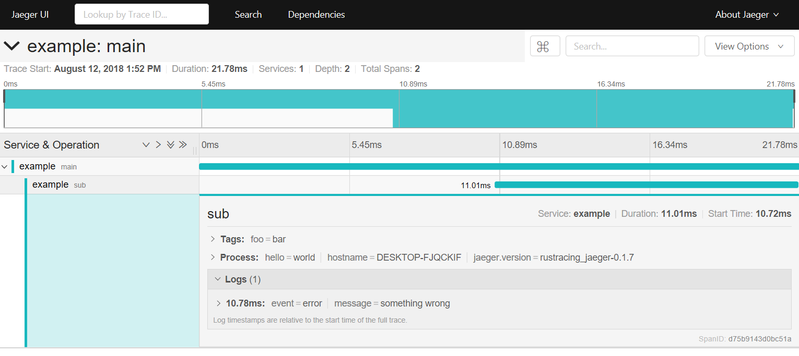

rustracing_jaeger
=================

[](https://crates.io/crates/rustracing_jaeger)
[](https://docs.rs/rustracing_jaeger)
[](https://github.com/sile/rustracing_jaeger/actions)
[](https://coveralls.io/github/sile/rustracing_jaeger?branch=master)
[](LICENSE)

[Jaeger][jaeger] client library created on top of [rustracing].

[jaeger]: https://github.com/jaegertracing/jaeger
[rustracing]: https://crates.io/crates/rustracing

[Documentation](https://docs.rs/rustracing_jaeger)

Examples
--------

### Basic Usage

```rust
use rustracing::sampler::AllSampler;
use rustracing_jaeger::Tracer;
use rustracing_jaeger::reporter::JaegerCompactReporter;

// Creates a tracer
let (span_tx, span_rx) = crossbeam_channel::bounded(10);
let tracer = Tracer::with_sender(AllSampler, span_tx);
{
    let span = tracer.span("sample_op").start();
    // Do something

} // The dropped span will be sent to `span_rx`

let span = span_rx.try_recv().unwrap();
assert_eq!(span.operation_name(), "sample_op");

// Reports this span to the local jaeger agent
let reporter = JaegerCompactReporter::new("sample_service").unwrap();
reporter.report(&[span]).unwrap();
```

### Executes `report.rs` example

```console
# Run jaeger in background
$ docker run -d -p6831:6831/udp -p6832:6832/udp -p16686:16686 jaegertracing/all-in-one:latest

# Report example spans
$ cargo run --example report

# View spans (see the image below)
$ firefox http://localhost:16686/
```



References
----------

- [Jaeger Client Library](https://www.jaegertracing.io/docs/latest/client-libraries/)
